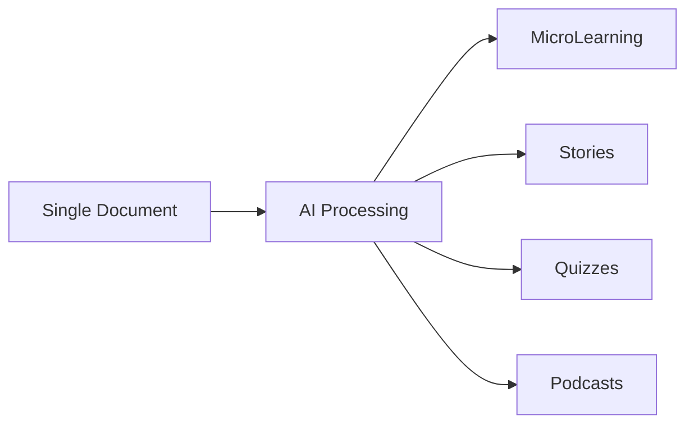

  
  
  # ✨ Welcome to the Future of AI Agents ✨
  
  
  
  

## 🚀 Transform One Document Into Infinite Possibilities

Imagine turning a single document into a complete learning ecosystem. That's not science fiction – that's BubblSpace TimeCapsule.

### 🎯 What Makes Us Different?

## 🌟 Features That Set Us Apart

### 🎓 Learning Revolution
- **MicroLearning Modules**
  - Bite-sized wisdom
  - Perfect for modern learners
  - Optimized for retention

### 📚 Content Magic
- **Usecase/Story Generation**
  - Turn dry docs into engaging narratives
  - Real-world applications
  - Memorable learning experiences

### 🧪 Interactive Learning
- **Smart Quiz Creation**
  - Auto-generated assessments
  - Adaptive difficulty
  - Instant feedback

### 🎙️ Audio Innovation
- **Podcast Generation**
  - Learn on the go
  - Professional voiceovers
  - Engaging audio content

## 🔮 Coming Soon
- Live AI interactions
- Real-time content generation
- Advanced customization options
- *And many more surprises!*

## 💡 Why Choose BubblSpace?

| Traditional Way | BubblSpace Way |
|----------------|----------------|
| Manual Content Creation | AI-Powered Automation |
| Single Format | Multi-Format Transformation |
| Time-Consuming | Instant Generation |
| Static Content | Dynamic & Interactive |

## 🤝 Join Our Thriving Community

### What You'll Get:
- 🌱 Regular skill development workshops
- 🎯 Expert guidance and support
- 🚀 Early access to new features
- 💫 Networking opportunities
- 🎁 Exclusive community perks

## 📈 Perfect For

### 🎯 Teams & Organizations
- 👥 **Communication Teams**
  - Transform internal documentation
  - Create engaging team updates
  - Generate consistent messaging
  - Streamline communication flows

- 🛠️ **Functional Teams**
  - Convert technical docs into training
  - Create team onboarding materials
  - Build knowledge bases
  - Standardize process documentation

- 🌐 **Open Source Community**
  - Generate comprehensive documentation
  - Create contributor guides
  - Build community resources
  - Share knowledge effectively

### 🎓 Educational Sector
- Educational Institutions
- Teachers & Trainers
- Corporate Training Teams
- Learning & Development Pros

### 🚀 Content Creators
- Digital Marketers
- Content Strategists
- Technical Writers
- Knowledge Management Teams

## 🌈 Start Your Journey

1. **Visit** [bubblspace.com](https://bubblspace.com)
2. **Join** our [Discord community](https://discord.gg/DetV6V9w)
3. **Connect** via [email](mailto:contact@bubblspace.com)

---

  
### 🌟 "Transforming the way we learn, one document at a time" 🌟

Made with ❤️ by the BubblSpace team | Pioneering AI-driven learning transformation

